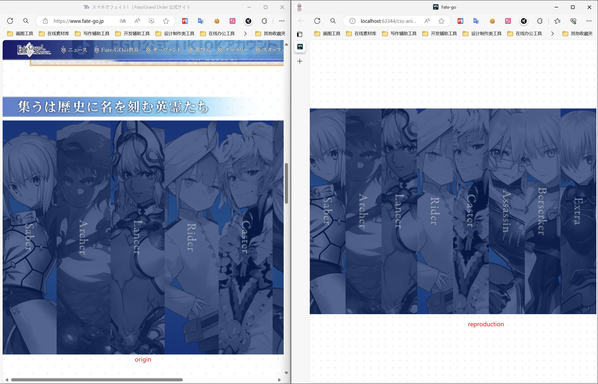

# CSS-ANIMATION
## 简介
个人收集或照着原型网站复刻的一些看起来还不错的效果
## 叠甲
个人不是前端开发工程师, 主要干Java的, 比较喜欢前端, 做着玩的
## e.g.
效果图

# CSS-ANIMATION
## Introduce
Personally collected or replicated CSS effects that I feel are quite good

## Prerequisite explanation
I am not a professional front-end development engineer, but due to my interests, the standardization and reliability of the code may not be very good. Please understand

## e.g.
example:

